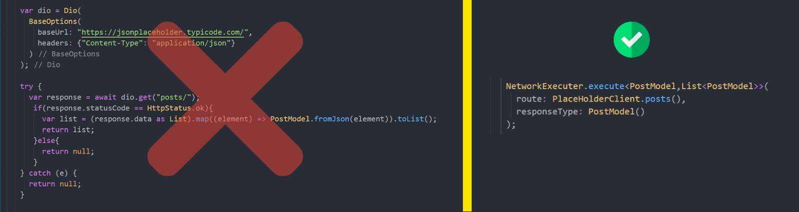

# Flutter Clean Network Layer

With Flutter's clean network layer, you can dynamically decode models, handle network errors, and create dynamic requests for each client.




## Use Of

**Network Executer**

```dart
NetworkExecuter.execute<PostModel,List<PostModel>>(route: PlaceHolderClient.posts(), responseType: PostModel());
```

**Network Errors**

```dart
NetworkError.request({required DioError error})
NetworkError.type({String? error})
NetworkError.connectivity({String? message})
```

## Packages used
```yaml
freezed
json_annotation
dio
connectivity
```

## Articles
#### English : https://ercangp.medium.com/clean-network-layer-in-flutter-dio-freezed-json-annotation-f5f2c41ac240
#### Türkçe : https://ercangp.medium.com/flutterda-temiz-network-kullan%C4%B1m%C4%B1-dio-freezed-json-annotation-f61b9df2be08


